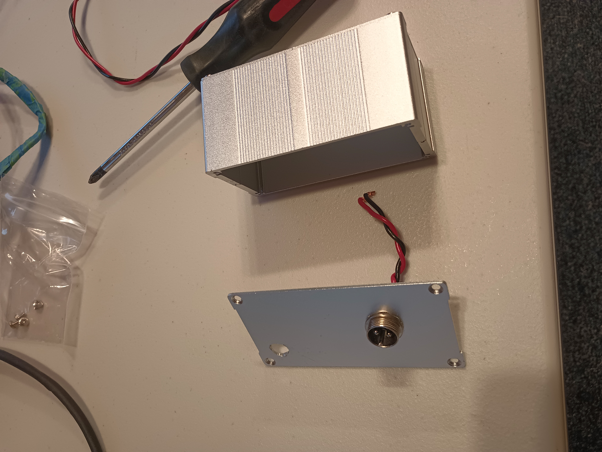

# <openPEMF>

## Description

Open source PEMF project that includes the hardware and firmware for anyone looking to build their own PEMF device

- Aren't there already some open source PEMF projects?  
    Yes, but many of them do not create the same fields used in the majority of published PEMF parameters

- Why share this project?  
    Because PEMF with the right parameters has the ability to change peoples lives. From regenerating cartilage to reducing inflamation, many people get out of pain they have had for years. Something this powerful should not be stuck behind high price tags.

- What problem does it solve?  
    PEMF devices with good parameters cost a lot, cheap PEMF devices do not create magnetic fields that use the parameters used in the majority of PEMF studies

## Table of Contents (Optional)

If your README is long, add a table of contents to make it easy for users to find what they need.

- [How To Build](#How-to-build)
- [Usage](#usage)
- [Credits](#credits)
- [License](#license)

## How to build

The Gerber files, BOM and .POS files are already for purchase at JLCPCB.com. You should be able to upload these to JLCPCB and order complete (or mostly complete - depending on part availability) PCBs ready to run! It would be great to have someone order a batch of these and sell kits for people uncomfortable with ordering/soldering PCBs.

This board is designed to fit in this enclosure:
https://www.ebay.com/itm/266629727778?mkcid=16&mkevt=1&mkrid=711-127632-2357-0&ssspo=g7l9ZZJUQN-&sssrc=2047675&ssuid=7-kgmmceqts&widget_ver=artemis&media=COPY

You can see that we used a simple circular connector to get the PEMF power through the encosure. Ideally a 4 pin connector would be used for larger coils/currents.

The coil should be wound from some form of wire. The closer the wires are together, the more effiencient the coil will be. Using regular insulated wire still works well, but you will get more magnetic field from using enameld magnet wire.

Here is what our prototype coil looked like:

## Usage
Once you have your PCBs, the first thing that you will want to do is upload the arduino code

To add a screenshot, create an `assets/images` folder in your repository and upload your screenshot to it. Then, using the relative filepath, add it to your README using the following syntax:

    

## Credits

List your collaborators, if any, with links to their GitHub profiles.

If you used any third-party assets that require attribution, list the creators with links to their primary web presence in this section.

If you followed tutorials, include links to those here as well.

## License

The last section of a high-quality README file is the license. This lets other developers know what they can and cannot do with your project. If you need help choosing a license, refer to [https://choosealicense.com/](https://choosealicense.com/).

---

🏆 The previous sections are the bare minimum, and your project will ultimately determine the content of this document. You might also want to consider adding the following sections.

## Badges

Badges aren't necessary, per se, but they demonstrate street cred. Badges let other developers know that you know what you're doing. Check out the badges hosted by [shields.io](https://shields.io/). You may not understand what they all represent now, but you will in time.

## Features

If your project has a lot of features, list them here.

## How to Contribute

If you created an application or package and would like other developers to contribute it, you can include guidelines for how to do so. The [Contributor Covenant](https://www.contributor-covenant.org/) is an industry standard, but you can always write your own if you'd prefer.

## Tests

Go the extra mile and write tests for your application. Then provide examples on how to run them here.